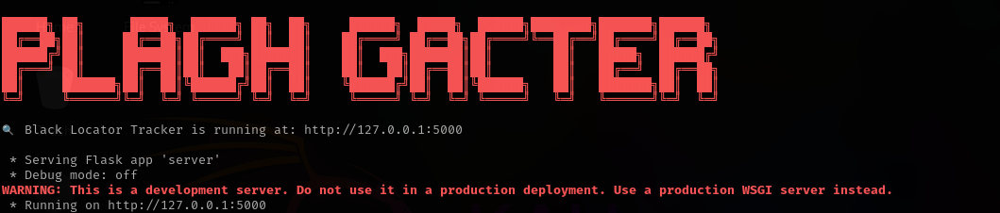

# Location Tracker Tool

This tool is designed to track the IP address and location of any user who opens a disguised PDF file. It is useful for educational or ethical testing purposes like phishing simulation, red teaming, or awareness campaigns.


 Features

- Sends a legitimate-looking PDF file.
- When opened, the victim's browser makes a hidden request to your Flask server.
- Logs the victim's IP address and approximate location (city, country).
- Saves all data in `visitor_logs.txt`.


| `server.py` | Flask server that handles incoming tracking requests |
| `pdf.py` | PDF-related logic or embedding tracking |
| `legitimate_document.pdf` | Fake PDF to send to the target |
| `static/track.html` | HTML file used to trigger the tracking |
| `visitor_logs.txt` | Log file to store IP/location info |

---
 How to Use

1. **Clone the repo**:
   ```bash
   git clone https://github.com/messi116/location-tracker.git
   cd location-tracker

   
## install dependencies

pip install -r requirements.txt

## Run the flask server

python3 server.py

## Info about how to send pdf to the target 

Send the PDF (legitimate_document.pdf) to the target.

## HOw to capture logs(ipv6+location(city))

Wait for logs in visitor_logs.txt when the file is opened.


# 🛰 Black Locator Tracker

A Flask-based IP location logger.

##  Terminal Banner





##  Run It

```bash
python server.py
